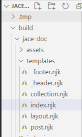
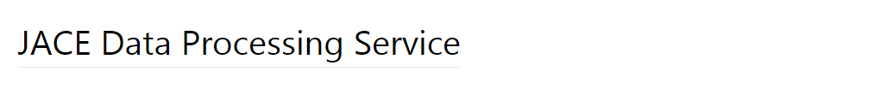
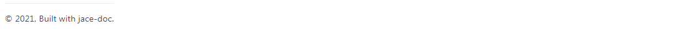
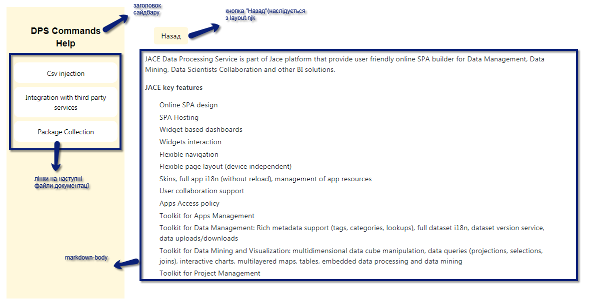
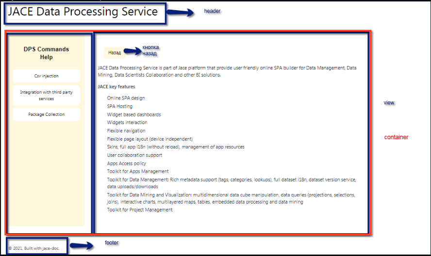
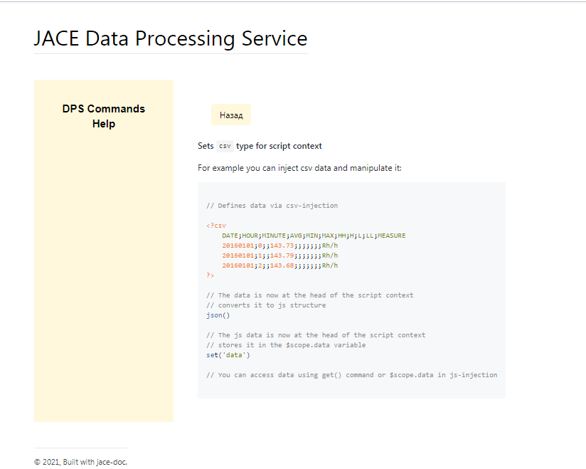

# Підсистема документування. Аналіз програмних засобів
## 1. Вступ

Даний документ надає описову інформацію по використаним програмним засобам при розробці підсистеми документування. Тобто, тут розміщено основні визначення та опис ПЗ, які використані у проекті.

## 2. Формат файлів для генерації веб-сторінки.
### 2.1 Загальний опис NJK

* [NJK](https://www.filesuffix.com/ru/extension/njk)(Nunjucks Template) - це потужний шаблонний механізм з успадкуванням, асинхронним управлінням в JavaScript.
* Механізм Nunjucks широко використовується у генерації HTML
* Використання API конфігурації
* За допомогою окремих шаблонів можна створити веб-сторінку
* [Офіційна документація по використанню nunjucks](https://mozilla.github.io/nunjucks/getting-started.html)
### 2.2Templating
* Можливе використання будь-якого розширення файлу, яке ви хочете для ваших файлів шаблонів Nunjucks, співтовариство Nunjucks прийняло .njk  
#### 2.2.1 Підсвічування синтаксису  
Посилання на модулі
* [atom]( https://github.com/alohaas/language-nunjucks)
* [vim](https://github.com/niftylettuce/vim-jinja)
* [brackets](https://github.com/axelboc/nunjucks-brackets)
* [sublime](https://github.com/mogga/sublime-nunjucks/blob/master/Nunjucks.tmLanguage)
* [emacs](http://web-mode.org)
* [vscode](https://github.com/ronnidc/vscode-nunjucks)  
#### 2.2.2 Приклади наслідування шаблону  
* Успадкування шаблонів - це спосіб спростити повторне використання коду. Під час написання шаблону ви можете визначити "блоки", які можуть замінити дочірні шаблони . Ланцюжок успадкування може бути скільки завгодно довгим.  
Якщо у нас є шаблон parent.html, який виглядає так:
```javascript

This is the default content


<section class="left">
  
</section>

<section class="right">
  
  This is more content
  
</section>
```  
І ми рендеримо цей шаблон:
```javascript



This is the left side!



This is the right side!

```  
На виводі ми отримуємо:
``` javascript
This is the default content

<section class="left">
  This is the left side!
</section>

<section class="right">
  This is the right side!
</section>
```  
Ви можете зберігати шаблон для успадкування у змінній і використовувати його, опускаючи лапки. Ця змінна може містити рядок, який вказує на файл шаблону, або може містити скомпільований об’єкт шаблон, який був доданий до контексту. Таким чином, ви можете динамічно змінювати, який саме шаблон успадковується під час рендерингу, встановлюючи його в контексті.
```javascript

```  
Ви використовуєте успадкування за допомогою тегів <b>extends</b> і <b>block</b>. 
## 3. Опис генерації веб-сторінки у проекті jace-doc.

### 3.1 Рендиринг

* **Markdown-it**

Рендиринг у проекті відбувається через [markdown-it](https://github.com/markdown-it/markdown-it). Це новий парсер markdown, ключова особливість якого - простота розширення синтаксису. При використанні маркдауна користувач рано чи пізно впирається в те, що чогось не вистачає і треба робити HTML-вставки. У markdown-it можна додавати нові елементи синтаксису через плагіни. В результаті зберігається безпека згенерованої HTML-розмітки і немає необхідності використовувати складні валідатори на кшталт owasp для захисту від XSS.

Парсер написаний на JavaScript і поширюється під ліцензією MIT. Підтримується робота як в браузері, так і в Node.js. Незважаючи на мову програмування і закладену гнучкість, markdown-it має дуже високу швидкість, поступаючись тільки скомпільованим варіантам на С (у яких немає подібної розширюваності). Іншою приємною особливістю парсеру є слідування специфікації CommonMark.

* __Micromatch__

__[Micromatch](https://www.npmjs.com/package/micromatch)__ - високо оптимізована бібліотека зіставлення підстановок та глобусів. Заміна і швидша альтернатива minimatch та multimatch. Використовується webpack, babel core, yarn, jest, браузер-синхронізацією, documentation.js, stylelint, nyc, ava та багатьма іншими.

_Extended globbing_

Micromatch підтримує наступні розширені функції глобалізації.

| **шаблон** | **еквівалентний регулярний вираз** | **опис** |
| --- | --- | --- |
| `?(pattern)` | `(pattern)?` | Відповідає нулю або одному входженню даних шаблонів |
| `*(pattern)` | `(pattern)*` | Відповідає нулю або декільком випадкам входження даних шаблонів |
| `+(pattern)` | `(pattern)+` | Відповідає одному або декільком випадкам входження даних шаблонів |
| `@(pattern)` | `(pattern)` <sup>*</sup> | Відповідає одному з даних шаблонів |
| `!(pattern)` | N/A (еквівалентний регулярний вираз набагато складніший) | Відповідає будь-скільком, крім одного з поданих шаблонів |

### 3.2 Шаблони .njk 

Підсистема генерує вебсайт за допомогою шаблонів .njk. Данні шаблони є доступними та простими у використанні.

У проекті вони розташовані за директорією ``` jace-dps-express\build\templates\template.njk.```



Кожен з шаблонів має відповідну структуру:

* _header.njk_

``` js
<header class="header container"> 
  <h1>
    JACE Data Processing Service \\ назва сайту
  <hr> \\ горизонтальна лінія
  </h1>
  
</header>
```
Результат роботи цього шаблону:



* _footer.njk_

``` js
<footer class="container">
  <p style="text-align: right; \\ стиль
    font-size: 0.9em;
    padding: 1em 0;
    border-top: 1px solid #eaeaea;">
    
    &copy; 2021, Built with <a href="https://github.com/boldak/jace-doc">jace-doc</a>. \\ інформація, що міститься у footer
  </p>
</footer>

```

Результат роботи шаблону:



* index.njk - шаблон, по якому збирається увесь сайт

``` js
 \\ наслідування layout.njk


  
  <div class="markdown-body"> \\ розміщення документації з файлу .md
    
    <a href="javascript:history.back()" style="background-color: cornsilk;display: inline-block; \\ кнопка назад
    padding: 8px 16px;border-radius: 10%;color: black;margin:25px;"> \\ стиль для кнопки назад
        Назад
    </a>
    <br/>
    
    {{ content | safe }}
  </div>
  
  <ul class="table-of-content"> \\ формування сайдбару
    <div class="mt-5 text-white text-center w-5/6 mx-auto py-5 text-xl font-bold rounded bg-black title">\\стилі для заголовку сайдбару
           DPS Commands Help
         </div>
     \\ сборка сайдбара по посиланням на документацію .md
      <li class="my-2 py-3 bg-black text-white rounded-xl text-center blinking"> \\ стилі для кожного посилання
        <a href="{{ page.url }}"> \\ посилання
          {{ page.title }} 
        </a>
      </li>
    
  </ul>


```



* layout.njk - шаблон html, на якому зав'язані усі веб-сторінки

``` js
<!doctype html>
<html>
<head>
  <meta charset="utf-8">
  <meta http-equiv="x-ua-compatible" content="ie=edge">
  <title>{{ frontMatter.title }} - {{ config.siteTitle }}</title>
  <meta name="description" content="">
  <meta name="viewport" content="width=device-width, initial-scale=1">

  <link rel="stylesheet" href="{{ assets['main.css'] }}">\\підключення стилів
  <link rel="stylesheet" href="{{ assets['vuetify.min.css'] }}">
  <link rel="stylesheet" href="{{ assets['tomorrow.css'] }}">
  <link rel="stylesheet" href="{{ assets['github-markdown.css'] }}">
  <link href="https://unpkg.com/tailwindcss@%5E2/dist/tailwind.min.css" rel="stylesheet">
  
</head>

<body>
  
   \\ header

  <main class="container"> \\ вміст усієї сторінки

    <div class="view">
     
    </div>
  </main>

   \\ footer
</body>
</html>

```
* main.css - відповідає за всі стилі у шаблонах. В залежності від назви класу застосовується відповідний стиль

``` css
@import "_base.css";
/*@import "vuetify.min.css"
@import "github-gist.css"
*/
:root {
  --container-width: 700px;
}

.container {
  max-width: var(--container-width);
  margin: 1.5rem auto;
  display:flex;
}

.header {
	font-size: 40px;
	background-color: white;
	color: black;
}
.header-anchor {
	display: none;
}

.markdown-body {
	/*box-sizing: border-box;*/
	min-width: 200px;
	max-width: 980px;
	margin: 0 auto;
	padding: 45px;
}

@media (max-width: 767px) {
	.markdown-body {
		padding: 15px;
	}
}
.view{
	display:flex;
	flex-direction: row-reverse;
}
.table-of-content {
	color: black;
    background-color: cornsilk;
    flex: 1;
	font-family: system-ui,-apple-system,'Segoe UI',Roboto,Helvetica,Arial,sans-serif,'Apple Color Emoji','Segoe UI Emoji';
	padding-left: 1rem;
    display: list-item;
    padding-right: 1rem;
	position: relative;
    text-align: -webkit-match-parent;
	font-size: 15px;
	width: 16.4rem;
	box-sizing: border-box;
	overflow-y: auto;
}
.blinking:active {
	transform: translate(0px, 2px);
	-webkit-transform: translate(0px, 2px);
	box-shadow: 0 0 15px rgba(185, 177, 177, 0.5);
  }
  .title{
	font-family: "Montserrat", sans-serif;
  }
  
```
Результат стилізованої веб-сторінки


* collection.njk - шаблон, що збираэ посилання на маркдаун файли
``` js
 \\ наслідування


  <h1>{{ frontMatter.title }}</h1>\\ назва на посилання
  
  <ul>
     \\ проходимось циклом по collection
      <li>
        <a href="{{ post.url }}"> \\ збираємо усі url
          {{ post.frontMatter.title }}
        </a>
      </li>
    
  </ul>
  


```


* post.njk
``` js
 \\ наслідування 


  <article class="post">
    <h1>{{ frontMatter.title }}</h1> \\назви для подальших .md в сайдбарі

    
    {{ content | safe }}
  </article>
  
  

```
Результат роботи post.njk collection.njk


### 3.2 Micromatch у проекті 

``` js
module.exports = {
	  protocol: process.env.PROTOCOL || "http",	
      url: `${process.env.APP_HOST || "localhost:8098"}/doc`,
      source: "./src/modules/dj-dps-commands",
      includes:["**/*.(md|markdown)","!**/node_modules"], \\ пошук у проекті .md --> застосування micromatch
      output: "./.tmp/public/doc",
      templates: "./build/jace-doc/templates",
      assets:"./build/jace-doc/assets"
}
```


